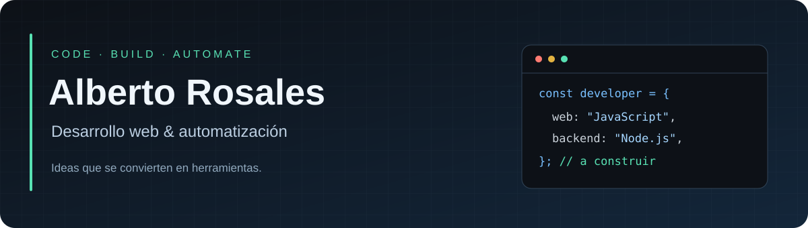

  

  <b>Aplicaciones web · Integraciones de APIs · Automatización</b> 
  Construyo herramientas para conectar sistemas y simplificar tareas.

  <a href="#proyectos-destacados">Proyectos destacados</a> ·
  <a href="#tecnologías">Tecnologías</a> ·
  <a href="https://github.com/albertrosales?tab=repositories">Todos mis repositorios</a>

---

### Hola, soy Alberto 👋

Mis proyectos combinan desarrollo web, automatización y servicios conectados por APIs. Aquí comparto herramientas para educación, medios digitales y negocios.

- **Educación:** paneles administrativos e integración con Moodle.
- **Medios digitales:** bots y flujos de publicación con asistencia de IA.
- **Aplicaciones web:** interfaces y servicios que resuelven necesidades concretas.

### Tecnologías

  
  
  
  
  

**Integraciones:** REST APIs · WordPress · Telegram · Moodle

### Proyectos destacados

| Proyecto | Qué encontrarás |
| :--- | :--- |
| **🎓 [Panel administrativo escolar](https://github.com/albertrosales/panel-admin-escolar)** | Gestión de alumnos, profesores y pagos conectada con Moodle. Node.js, Express y PostgreSQL. |
| **🤖 [Colón al Día · Bot de Telegram](https://github.com/albertrosales/colonaldia-telegram-bot)** | Preparación de noticias con IA y publicación en WordPress desde Telegram, con confirmación previa. |
| **📰 [XPublisher](https://github.com/albertrosales/xpublisher)** | Proyecto de publicación de noticias en X. |
| **🚗 [GozaApp](https://github.com/albertrosales/gozaapp)** | Proyecto de aplicación de transporte. |

---

  Aprender, construir, mejorar. Un proyecto a la vez.

